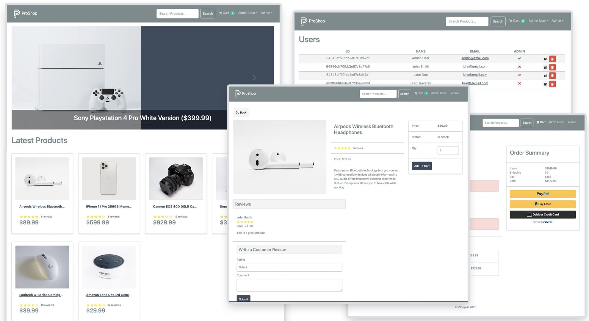

# ProShop — DevOps Implementation


**Live demo:** https://proshop.abdulrzzaq.com

A production-grade DevOps pipeline built around a full-stack MERN e-commerce application — containerized, continuously integrated, security-scanned, and automatically deployed to AWS, with a parallel Kubernetes deployment running on a self-hosted cluster.




> The application code is based on [ProShop v2](https://github.com/bradtraversy/proshop-v2) by Brad Traversy.
> All DevOps engineering — containerization, CI/CD, cloud infrastructure, TLS, and Kubernetes — is my own work.

---

## Architecture

### Production (AWS)

```
                        https://proshop.abdulrzzaq.com
                                    │
                              [ Nginx (host) ]          TLS termination — Let's Encrypt,
                                    │                   auto-renewed via certbot
                     ┌──────────────┴──────┐
                     │   Docker Compose    │            EC2 (Ubuntu 24.04)
                     │                     │
                     │  frontend ── backend ── mongo    internal network only —
                     │  (Nginx+React) (Node API) (v7)   single public entry point
                     └─────────────────────┘
                                    ▲
                        images pulled from Docker Hub
```

### CI/CD Pipeline

```
git push (dev) ──► CI: frontend build · backend deps · Trivy image scan · gitleaks
      │
PR ──► merge to main
      │
      ├──► CI re-runs against main
      └──► Docker Publish:
              build backend + frontend images (matrix)
              push to Docker Hub  →  :latest + :<commit-sha>
              deploy job → SSH to EC2 → pull → recreate containers
                                    │
                     live site updated — zero manual steps
```

### Kubernetes (self-hosted lab)

The same application runs on a **k3s** cluster (home server) from declarative manifests in [`k8s/`](k8s/):

- MongoDB with a **PersistentVolumeClaim**
- Backend: 2+ replicas, liveness/readiness **probes**, credentials via **Secret**, resource requests/limits
- **HPA** — autoscales the API 2→5 replicas at 60% CPU
- **Ingress** (Traefik) routing `/api` → backend, `/` → frontend

---

## Tech Stack

| Layer | Technology |
|---|---|
| Application | React 18 · Redux Toolkit · Node.js/Express · MongoDB (Mongoose) |
| Containers | Docker (multi-stage builds) · Docker Compose |
| CI/CD | GitHub Actions · Docker Hub |
| Security | Trivy (image CVE gate) · gitleaks (secret scanning) · hardened runtime images |
| Cloud | AWS EC2 · Nginx reverse proxy · Let's Encrypt TLS |
| Orchestration | Kubernetes (k3s) · Traefik Ingress · HPA |

---

## Repository Structure

```
├── backend/                  Express REST API — self-contained
│   ├── Dockerfile            hardened: npm removed from runtime image
│   └── package.json
├── frontend/                 React SPA
│   ├── Dockerfile            multi-stage: node build → nginx (~100MB)
│   └── nginx.conf            serves SPA + proxies /api to backend
├── k8s/                      Kubernetes manifests (namespace, mongo+PVC,
│                             backend+probes, frontend, ingress, HPA)
├── .github/workflows/
│   ├── ci.yml                build checks + Trivy + gitleaks
│   └── docker-publish.yml    image build/push + SSH deploy to EC2
├── docker-compose.yml        local development stack
└── docker-compose.prod.yml   production stack (pulls published images)
```

---

## Running Locally

Requires Docker only — no Node or MongoDB installation.

```bash
docker compose up -d --build
docker compose exec backend node seeder     # sample data
```

Store: http://localhost:3000 — admin login: `admin@email.com` / `123456`

### Environment

Backend configuration lives in `backend/.env` (never committed — see `backend/.env.example`):

```
PORT=5000
MONGO_URI=...
JWT_SECRET=...
PAYPAL_CLIENT_ID=...
```

Secrets are injected per environment: `.env` file locally, env file on the server, Kubernetes Secrets in the cluster, and GitHub Actions Secrets in the pipeline.

---

## Deploying to Kubernetes

```bash
kubectl apply -f k8s/namespace.yaml
kubectl create secret generic backend-secrets -n proshop \
  --from-literal=JWT_SECRET=$(openssl rand -hex 32) \
  --from-literal=PAYPAL_CLIENT_ID=sb
kubectl apply -f k8s/
kubectl exec -n proshop deploy/backend -- node seeder
```

---

## Roadmap

- [x] Containerization, compose environments, image hardening
- [x] CI with security gates · CD to AWS with zero-touch deploys
- [x] Custom domain + TLS
- [x] Kubernetes deployment with self-healing, rolling updates, autoscaling
- [ ] Terraform — full AWS infrastructure as code
- [ ] Monitoring — Prometheus · Grafana · alerting
- [ ] GitOps — Argo CD

---

## Author

**Abdulrazzaq (QALAWFI)** — DevOps portfolio project.
Application code by [Brad Traversy](https://github.com/bradtraversy).
